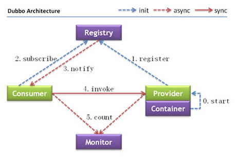

# Dubbo介绍
---
## Dubbo概念
##### Dubbo是个分布式服务框架，只有在分布式的时候，才有Dubbo这样的分布式服务框架的需求。本质上就是远程服务调用的分布式框架。
#### Dubbo的核心部分包括：
* 远程通讯
* 集群容错
* 自动发现

#### Dubbo能做什么
* 透明化的远程方法调用，就像调用本地方法一样调用远程方法，只需要简单配置
* 软负载均衡及容错机制
* 服务自动注册与发现，不需要写死服务提供方的地址，注册中心基于接口名查询服务提供者的ip地址，并能够平滑增加或删除服务提供者

#### Dubbo的架构图

##### 节点角色说明：
* Provider：暴露服务的服务提供方
* Consumer：调用远程服务的服务消费方
* Registry：注册中心
* Monitor：统计服务的调用次数和调用时间的监控中心
* Container：服务运行的容器

#### 调用关系
* 0.服务容器启动，加载，运行服务提供者
* 1.服务提供者在启动时，向注册中心注册自己提供的服务
* 2.服务消费者在启动时，向注册中心订阅自己需要的服务
* 3.注册中心返回服务提供者地址列表给消费者，如果有变更，注册中心会基于长连接推送变更数据给消费者
* 4.服务消费者从提供者地址列表中，基于软负载均衡算法，选一台提供者进行调用，如果调用失败，再换一台调用
* 5.消费者和提供者在内存中累计调用次数和调用时间，定时每分钟发送一次统计数据到监控中心

##### 环境搭建示例（引用CSDN小宝鸽的文章）：
[Dubbo分布式服务框架入门（附工程）](http://blog.csdn.net/u013142781/article/details/50387583?_blank)
